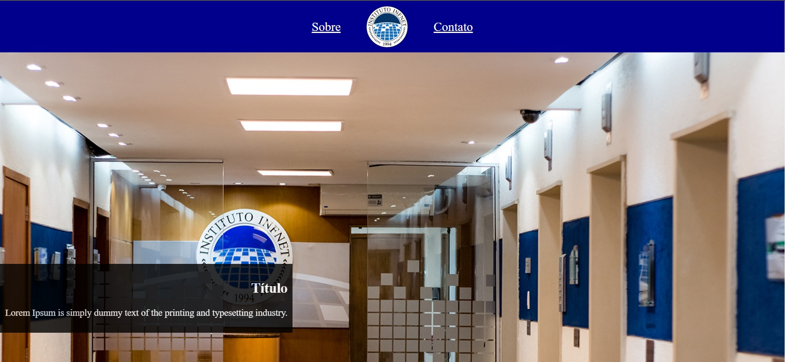

   

# Live Coding

## Teste de Perfomance 3 - C

Recrie o layout da imagem seguindo as especificações. Ela pode ser melhor visualizada na pasta `assets`.

## Especificações

1. O site gerará barra de rolagem por causa do tamanho da imagem de fundo.
2. O header possui `display: flex`.
3. O header mantém visivel mesmo após a rolagem.
4. O painel possui largura de acordo com seu conteúdo.
5. A imagem de fundo deve ser feita com a tag `img`.
6. Use o `index.html` e `style.css` que estão no projeto como base, mas modificações podem e devem ser realizadas.
