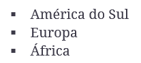

    

# Teste de Performance 2

## Exercício 01

### _ENUNCIADO:_

No arquivo `index.html`, recrie a lista abaixo:

    

---

### _OBSERVAÇÕES:_

- **Os tópicos da lista, devem estar no formato `quadrado`**
- **A estilização deve estar apenas no arquivo `style.css`**