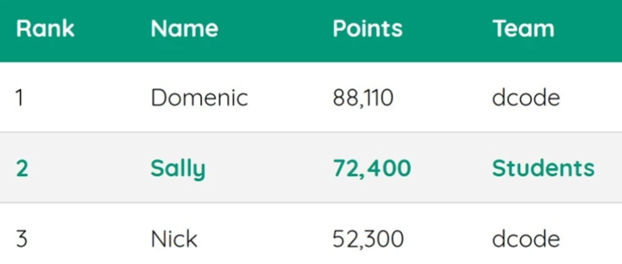

    

# Teste de Performance 3

## Exercício 05

### _ENUNCIADO:_

Nesse exercício:

Crie uma `tabela`, incluindo a estilização `(tente aproximar as cores o máximo possível)`, conforme a imagem abaixo:

---

### _OBSERVAÇÕES:_

- **Deve `recriar` a imagem de exemplo**
- **A estilização deve estar apenas no arquivo `style.css`**